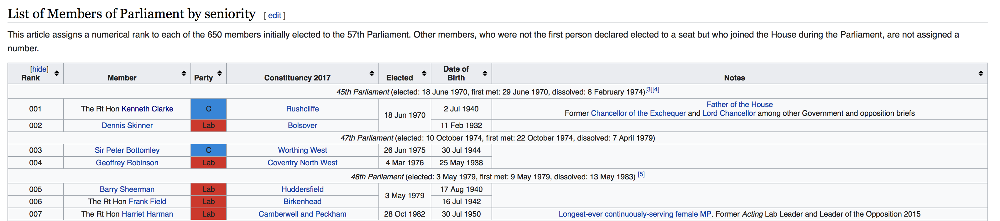
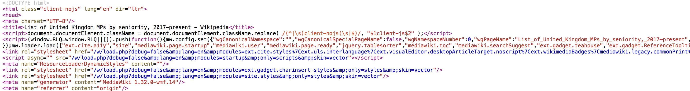
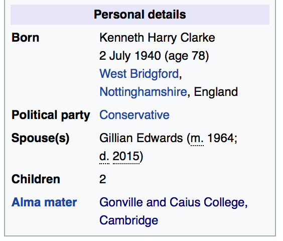
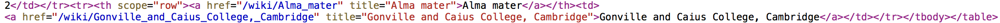

You will need to load the following library (you may need to use `install.packages()` first):
```{r, eval=T, message = F}
library(rvest)
```

`rvest` is a nice package which helps you to scrape information from web pages.

*Warning: Collecting data from the web ("web scraping") is usually really annoying. There is no single function that will give you the information you need from a webpage. Instead, you must carefully and painfully write code that will give you what you want. If that sounds OK, then continue on with this problem set. If it doesn't, stop here, and do something else.*

## Scraping the web

Throughout this course, the modal structure of a problem set has been that we give you a nice, clean, rectangular `data.frame`, which you use for the application of some fancy method. Here, we are going to walk through an example of getting the horrible, messy, and oddly-shaped data from a webpage, and turning it into a `data.frame` that is usable.

We are going to set ourselves a typical data science-type task in which we are going to scrape some data about politicians from their wiki pages. In particular, our task is to establish which universities were most popular amongst the current crop of UK MPs. It is often useful to define in advance what the exact goal of the data collection task is. For us, we would like to finish with a `data.frame` consisting of 650 observations (one for each MP), and two variables: the MPs name, and where they went to university.

### Step 1: Scrape a list of current MPs

First, we need to know which MPs are currently in parliament. A bit of googling shows that [this wiki page](https://en.wikipedia.org/wiki/List_of_United_Kingdom_MPs_by_seniority,_2017–present) gives us what we need. Scroll down a little, and you will see that there is a table where each row is an MP. It looks like this: 



The nice thing about this is that an html table like this should be reasonably easy to work with. We will need to be able to work with the underlying html code of the wiki page in what follows, so you will need to be able to see the source code of the website. If you don't know how to look at the source code, follow the relevant instructions on [this page](https://www.computerhope.com/issues/ch000746.htm) for the browser that you are using.

When you have figured that out, you should be able to see something that looks a bit like this:



As you can see, html is horrible to look at. In R, we can read in the html code by using the `read_html` function from the `rvest` package:

```{r}

# Read in the raw html code of the wiki page
mps_list_page <- read_html("https://en.wikipedia.org/wiki/List_of_United_Kingdom_MPs_by_seniority,_2017–present")

```

`read_html` returns an XML document (to check, try running `class(mps_list_page)`), which makes navigating the different parts of the website (somewhat) easier. 

Now that we have the html code in R, we need to find the parts of the webpage that contain the table. Scroll through the source code that you should have open in your browser to see if you can find the parts of the code that contain the table we are interested in.

On line 222, you should see something like `<table class="wikitable collapsible sortable" style="text-align: center; font-size: 85%; line-height: 14px;">`. This marks the beginning of the table that we are interested in, and we can ask `rvest` to extract that table from our `mps_list_page` object by using the `xml_find_all` function.

```{r}

# Extract table of MPs
mp_table <- xml_find_all(mps_list_page, xpath = "//table[@class='wikitable collapsible sortable']")

```

Here, the string we pass to the `xpath` argument tells `rvest` that we would like to grab the `table` from the object `mps_list_page` that has the class `wikitable collapsible sortable`. The object we have created (`mp_table`) is itself an XML object, which is good, because we will need to navigate through that table to get the information we need.

Now, within that table, we would like to extract two pieces of information for each MP: their name, and the link to their own individual wikipedia page. Looking back at the html source code, you should be able to see that each MP's entry in the table is contained within its own separate `<span>` tag, and the information we are after is further nested within a `<a>` tag. For example, line 276 includes the following:


Yes, Bottomley is a funny name.

We would like to extract all of these entries from the table, and we can do so by again using `xml_find_all` and using the appropriate Xpath expression, which here is `".//span/a"`, where the full-stop indicates that we would like to search only within this table.

```{r}

mp_table_entries <- xml_find_all(mp_table, xpath = ".//span/a")

```

Finally, now that we have the entry for each MP, it is very simple to extract the name of the MP and the URL to their wikipedia page:
```{r}

mp_names <- xml_text(mp_table_entries) # xml_text returns the text between the tags (here, the MPs' names)

mp_hrefs <- xml_attr(mp_table_entries, "href") # xml_attr returns the attrubutes of the tags that you have named. Here we have asked for the "href" which will give us the link to each MP's own wiki page 

# Combine into a data.frame
mps <- data.frame(name = mp_names, url = mp_hrefs, university = NA, stringsAsFactors = FALSE)
head(mps)
```

OK, OK, so those urls are not quite complete. We need to fix "https://en.wikipedia.org" to the front of them first. We can do that using `paste()`:

```{r}

mps$url <- paste("https://en.wikipedia.org", mps$url, sep = "")
head(mps)
```

That's better. 

Are you still here? Well done! We have something! We have...a list of MPs' names! But we don't have anything else. In particular, we still do not know where these people went to university. To find that, we have to move on to step 2.

### Step 2: Scrape the wiki page for each MP

Let's look at the page for the first MP in our list: [https://en.wikipedia.org/wiki/Kenneth_Clarke](https://en.wikipedia.org/wiki/Kenneth_Clarke). Scroll down the page, looking at the panel on the right-hand side. At the bottom of the panel, you will see this:



The bottom line gives Clarke's alma mater, which in this case is one of the Cambridge colleges. That is the information we are after. If we look at the html source code for this page, we can see that the alma mater line of the panel is enclosed in another `<a>` tag:



Now that we know this, we can call in the html using `read_html` again:

```{r}

  mp_text <- read_html(mps$url[1])

```

And then we can use `xml_find_all` and `xml_text` to extract the name of the university. The `xpath` argument is a bit more complicated here. We are telling `rvest` to look for the tag `a` with a title of `"Alma mater"`, and then asking `rvest` to look for the *next* `a` tag that comes after the alma mater tag. This is because the name of the university is actually stored in the subsequent `a` tag.

```{r}
  
  mp_college <- xml_text(xml_find_all(mp_text, xpath = "//a[@title='Alma mater']/following::a[1]"))
  print(mp_college)

```

Regardless of whether you followed that last bit: it works! We now know where Kenneth Clarke went to university. Finally, we can assign the university that he went to to the `mps` `data.frame` that we created earlier:

```{r}
  
  mps$university[1] <- mp_college
  head(mps)
  
```


## Exercises

1. Figure out how to collect this university information for all of the other MPs in the data. You will need to write a for-loop, which iterates over the URLs in the `data.frame` we just constructed and pulls out the relevant information from each MP's wiki page. You will find very quickly that web-scraping is a messy business, and your loop will probably fail. You might want to use the `stop`, `next`, `try` and `if` functions to help avoid problems.

2. Which was the modal university for the current set of UK MPs?

3. Go back to the scraping code and see if you can add some more variables to the data.frame. Can you scrape the MPs' party affiliations? Can you scrape their date of birth? Doing so will require you to look carefully at the html source code, and work out the appropriate xpath expression to use. For guidance on xpath, see [here](https://blog.scrapinghub.com/2016/10/27/an-introduction-to-xpath-with-examples).